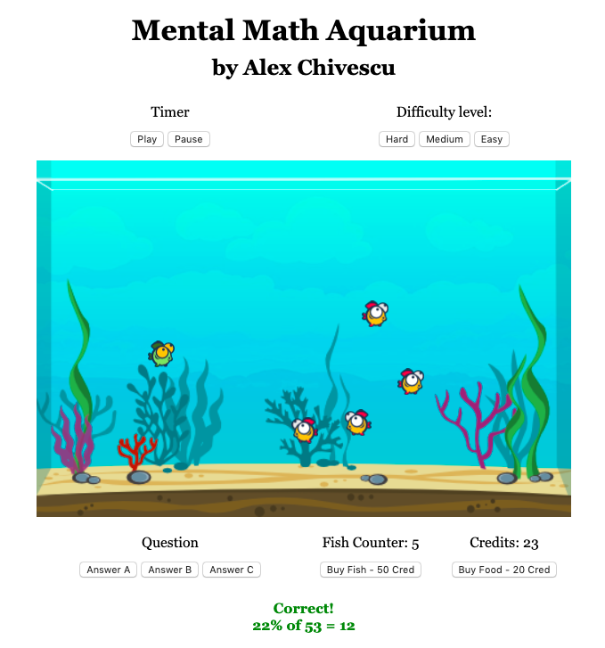

# Mental Math Aquarium - Web Version :computer: :repeat: :tropical_fish:

This game is designed to help train your mental math skills in a fun aquatic environment.

## Getting Started

To run the game [click here](https://alexchivvy.github.io/mental-math-aquarium/). You will open the game page with brief instructions for play.

:warning: The game is not compatible with mobile. You have to run in a browser on you notebook or desktop PC.

## How to play

To start the game click on the yellow button **START GAME**. After that the archer and the ballons will show up. You can move the archer for a better shoot using the keyboard's arrows.

You begin the game with 1 fish and unlimited mental math questions, each with an initial timer of 10 seconds. The time you take to answer each question is converted into credits, which can be used to either buy additional fish or feed your current tank. 

## Built With

To make this adaptation we use:

* HTML Canvas element and vanilla JavaScript to draw graphics
* CSS to controls how webpages look
* Bootstrap
* Fish Pack by Andrew Tidey | License (<a href="http://creativecommons.org/publicdomain/zero/1.0/">Creative Commons Zero, CC0</a>)
* Sound effects obtained from https://www.zapsplat.com
* Royalty free music from https://www.fesliyanstudios.com

## Contributing

You can contribute with this project. To do that fork this repository make your changes and create a pull request.
 
## Future improvements

- [ ] Improve initial instruction communication
- [ ] Add CSS styling for buttons 
- [ ] Finish implementing sound effects 
- [ ] Add flexible sizing / mobile-friendly version
- [ ] Add predatory fishies and older fishies